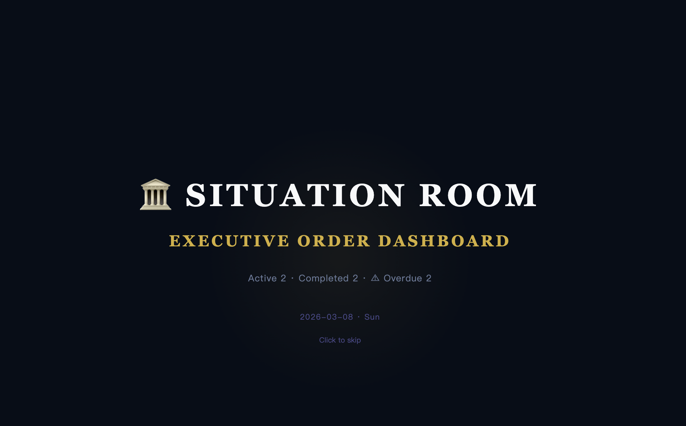
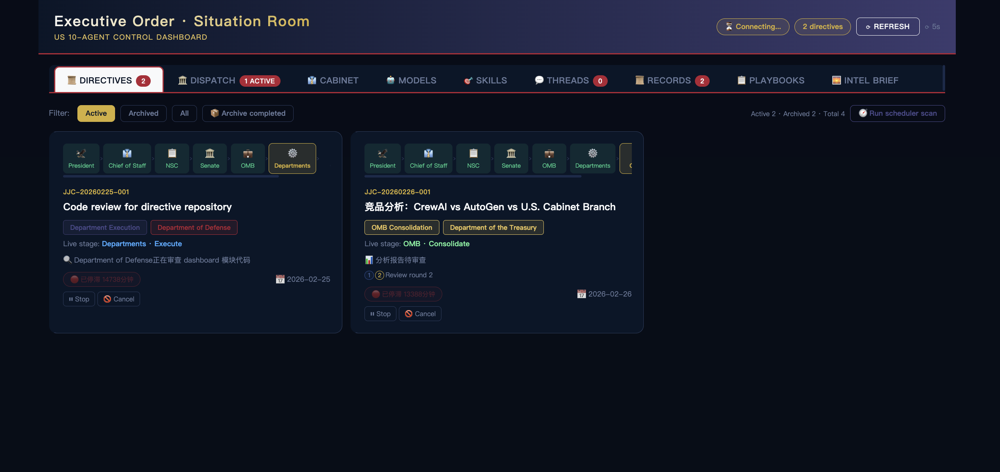

# ⚖️ Executive Order

> **⚠️ INCUBATION NOTICE**
> This project is currently in final incubation phase. Core architecture is complete and functional, but full integration testing is underway. Expected to be production-ready within 1-2 days. Watch this repo for updates.

**I redesigned AI multi-agent collaboration architecture using the 237-year-old U.S. Constitution.**

**Turns out, the framework hammered out in that un-air-conditioned Philadelphia summer of 1787 handles stress tests better than your YAML config files.**

---

## 🤔 Why the U.S. Constitution?

Edict used a Chinese system that lasted 1,400 years. Very strong.

But the U.S. Constitution did something the Three Departments and Six Ministries never did:

**Judicial Review**

The Supreme Court can overturn executive orders and declare any agency's actions unconstitutional.

What does this mean for AI agent collaboration?

When two agents produce conflicting outputs, when an agent oversteps its authority, when the planning layer and execution layer dispute results—**who arbitrates?**

Edict doesn't have this layer. CrewAI doesn't. AutoGen doesn't.

**Madison figured it out in 1787.**

- The Senate agent has filibuster power. We seriously considered having it continuously output objections to bad execution plans until timeout. Ultimately didn't implement.
- The Supreme Court is the new role this project adds over Edict. When two agents' outputs contradict each other and neither backs down, the case goes to the Supreme Court. Justices serve for life, no retry.

Madison wrote in Federalist No. 51 in 1787:

> "If men were angels, no government would be necessary."

**AI isn't angels. So we built it a government.**

```
You (President) → Chief of Staff (Triage) → NSC (Planning) → Senate (Review)
      ↑                                                      ↓
Supreme Court (Arbitration) ←─── Dispute Appeal ←─── OMB (Dispatch)
      ↓ Ruling                                      ↓
                              Departments Execute → Report to President
```

---

## 📊 Framework Comparison

| | CrewAI | MetaGPT | AutoGen | Edict (三省六部) | Executive Order |
|---|:---:|:---:|:---:|:---:|:---:|
| Review Mechanism | ❌ | ⚠️ Optional | ⚠️ Human-in-loop | ✅ Menxia Veto | ✅ Senate Filibuster |
| Judicial Arbitration | ❌ | ❌ | ❌ | ❌ | **✅ Supreme Court** |
| Real-time Dashboard | ❌ | ❌ | ❌ | ✅ | ✅ Situation Room |
| Task Intervention | ❌ | ❌ | ❌ | ✅ | ✅ Presidential Veto |
| Complete Audit | ⚠️ | ⚠️ | ❌ | ✅ | ✅ Congressional Record |
| Agent Health Monitor | ❌ | ❌ | ❌ | ✅ | ✅ |
| Hot-swap Models | ❌ | ❌ | ❌ | ✅ | ✅ |
| Agent Count | Custom | Custom | Custom | 12 | **10 (Leaner)** |
| Deployment | Medium | High | Medium | Low | **Low · Docker One-Click** |

**Core Difference: Institutional Review + Judicial Arbitration + Full Observability + Real-time Intervention**

---

## 📸 Screenshots

<p align="center">
  
  <br>
  <sub>🚪 Entry Page - Presidential Inauguration</sub>
</p>

<p align="center">
  
  <br>
  <sub>🏛️ Situation Room Dashboard - Real-time Agency Monitoring</sub>
</p>

---

## 🏛️ Ten-Agent Architecture

### Flow Path

```
┌─────────────────────────────────────────┐
│           👔 President (You)             │
│     Slack · Telegram · Signal · Email    │
└──────────────────┬──────────────────────┘
                   │ Executive Order
┌──────────────────▼──────────────────────┐
│         🏠 Chief of Staff               │
│   Triage: Chat → Reply / Task → Ticket  │
└──────────────────┬──────────────────────┘
                   │ Briefing
┌──────────────────▼──────────────────────┐
│    📋 National Security Council (NSC)   │
│       Receive → Plan → Decompose         │
└──────────────────┬──────────────────────┘
                   │ Submit for Review
┌──────────────────▼──────────────────────┐
│           🏛️ Senate                     │
│    Hearing → Approve / Filibuster 🚫    │
└──────────────────┬──────────────────────┘
                   │ Approved ✅
┌──────────────────▼──────────────────────┐
│    💼 OMB (Office of Mgmt & Budget)     │
│   Dispatch → Coordinate → Consolidate   │
└──┬─────┬──────┬──────┬──────┬───────────┘
   │     │      │      │      │
┌──▼──┐ ┌▼────┐ ┌▼───┐ ┌▼───┐ ┌▼──────┐
│ 🏦  │ │ 🌐  │ │ 🛡️ │ │ ⚖️ │ │  🔧   │
│Treasury│State│ DOD │ DOJ │Commerce│
└─────┘ └─────┘ └────┘ └────┘ └───────┘
          Dispute Appeal ↓
┌─────────────────────────────────────────┐
│         ⚖️ Supreme Court                │
│  Dispute Resolution · Final Ruling      │
└─────────────────────────────────────────┘
```

### Ten Agents

**🏠 Chief of Staff** (`chief_of_staff`)
- Message triage: chat → direct reply / task → create ticket
- Data cleaning and intent extraction
- Single entry point to the system

**📋 NSC** (`nsc`)
- Strategic planning and task decomposition
- Determine department assignments and dependencies
- Output structured execution plan

**🏛️ Senate** (`senate`)
- Quality gate: review NSC's plan
- Approve or Filibuster (reject with required changes)
- Mandatory review—no exceptions

**💼 OMB** (`omb`)
- Dispatch tasks to departments
- Track progress and handle dependencies
- Consolidate results and report to President

**⚖️ Supreme Court** (`supreme_court`) — **New role vs. Edict**
- Arbitrate disputes between agents
- Override decisions when agents conflict
- Final ruling—no appeals

**🏦 Treasury** (`treasury`)
- Data analysis, reports, cost accounting
- Python, SQL, Excel/CSV processing

**🌐 State Department** (`state_dept`)
- Technical documentation, specs, communications
- Markdown, technical writing, translations

**🛡️ Department of Defense** (`dod`)
- Code development, algorithms, engineering
- Python, TypeScript, Go, Rust

**⚖️ Department of Justice** (`doj`)
- Security audits, compliance checks
- OWASP, GDPR/CCPA, CVE scanning

**🔧 Commerce** (`commerce`)
- CI/CD, deployment, infrastructure
- Docker, GitHub Actions, Terraform

---

## 🗺️ Permission Matrix

| From ↓ \ To → | CoS | NSC | Senate | OMB | Treasury | State | DoD | DoJ | Commerce | Supreme Court |
|---|:---:|:---:|:---:|:---:|:---:|:---:|:---:|:---:|:---:|:---:|
| President | ✅ | | | | | | | | | |
| Chief of Staff | — | ✅ | | | | | | | | |
| NSC | ✅ | — | ✅ | | | | | | | ⚠️ Appeal |
| Senate | | ✅ | — | ✅ | | | | | | ⚠️ Appeal |
| OMB | | ✅ | ✅ | — | ✅ | ✅ | ✅ | ✅ | ✅ | ⚠️ Appeal |
| Departments | | | | ✅ | | | | | | ⚠️ Appeal |
| Supreme Court | | ✅ | ✅ | ✅ | ✅ | ✅ | ✅ | ✅ | ✅ | — |

⚠️ Appeal = Only triggered during disputes, not part of daily flow

---

## 📋 Task State Machine

```
President → CoS Triage → NSC Plan → Senate Review → OMB Dispatch → Execute → Review → ✅ Done
                                  ↑         │                              │
                                  └── Filibuster ──┘                       ↓
                                                              ⚖️ Supreme Court (disputes)
                                                                           │
                                                                    Blocked / Resume
```

**Nine States:**
- `pending` - Awaiting triage
- `planning` - NSC planning
- `under_review` - Senate reviewing
- `filibustered` - Rejected, sent back to NSC
- `dispatched` - OMB dispatched
- `in_progress` - Executing
- `pending_review` - Awaiting final review
- `blocked` - Dispute blocked, awaiting Supreme Court
- `completed` - Done, archived as Executive Record

---

## 🚀 Quick Start

### Docker

```bash
docker run -p 7891:7891 your-username/directive
```

Open http://localhost:7891

### Full Install

```bash
git clone https://github.com/your-username/directive.git
cd directive
chmod +x install.sh && ./install.sh
```

Run:

```bash
# Terminal 1
bash scripts/run_loop.sh

# Terminal 2
python3 dashboard/server.py

# Browser
open http://127.0.0.1:7891
```

---

## 🎯 Example Usage

Send to Chief of Staff via Slack/Telegram/Signal:

```
Design a user authentication system:
1. RESTful API (FastAPI)
2. PostgreSQL + JWT
3. Full test coverage
4. Deployment docs
5. Security audit included
```

Watch in Situation Room:

1. 🏠 Chief of Staff identifies task, extracts requirements, sends to NSC
2. 📋 NSC plans: 5 subtasks, assigns DoD + Commerce + State + DoJ
3. 🏛️ Senate reviews: Approved (note: DoJ must audit JWT security)
4. 💼 OMB dispatches: DoD codes, Commerce builds CI/CD, State writes docs, DoJ audits
5. ⚖️ DoD and DoJ dispute code security → Appeal to Supreme Court → Ruling: Adopt DoJ's recommendation
6. ✅ OMB consolidates, reports to President, archives as Executive Record

---

## 📁 Project Structure

```
directive/
├── agents/
│   ├── chief_of_staff/SOUL.md
│   ├── nsc/SOUL.md
│   ├── senate/SOUL.md
│   ├── omb/SOUL.md
│   ├── supreme_court/SOUL.md
│   ├── treasury/SOUL.md
│   ├── state_dept/SOUL.md
│   ├── dod/SOUL.md
│   ├── doj/SOUL.md
│   └── commerce/SOUL.md
├── dashboard/
│   ├── situation_room.html
│   └── server.py
├── scripts/
│   ├── run_loop.sh
│   ├── kanban_update.py
│   └── skill_manager.py
├── tests/
├── docs/
├── install.sh
└── docker-compose.yml
```

---

## 📋 Situation Room Dashboard

**10 Panels:**

1. **Order Board** - All Executive Orders by status, filters, search, heartbeat badges
2. **Agency Monitor** - Task distribution, department load, agent health cards
3. **Executive Records** - Completed orders archive with timeline
4. **Order Templates** - 9 preset templates with parameters
5. **Agency Personnel** - Token usage, activity stats
6. **Docket** - Supreme Court cases (pending & historical rulings)
7. **Intelligence Brief** - Daily tech/business news aggregation
8. **Model Config** - Per-agent LLM switching
9. **Skills Config** - View/add/update skills
10. **Inauguration** - Daily opening ceremony animation

---

## 🗺️ Roadmap

See [ROADMAP.md](ROADMAP.md)

---

## 🙏 Acknowledgements

Architecture inspiration from:

- [wanikua/boluobobo-ai-court-tutorial](https://github.com/wanikua/boluobobo-ai-court-tutorial) - AI Court Tutorial
- [cft0808/edict](https://github.com/cft0808/edict) - Three Departments and Six Ministries
- U.S. Constitution (1787) - Separation of Powers and Judicial Review

---

## 📄 License

MIT
